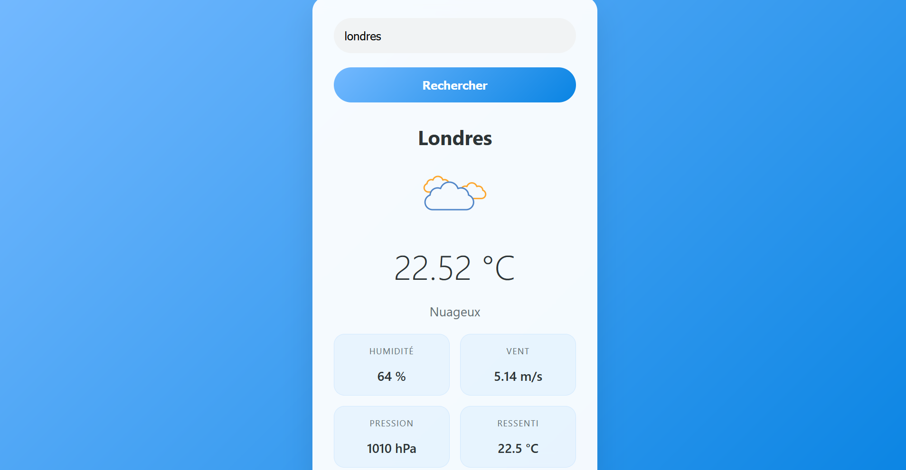

# 🌤️ meteoApp

Une application météo simple et responsive qui permet d'afficher les conditions météorologiques en temps réel d'une ville donnée grâce à l'API **OpenWeatherMap**.

---

## 🧭 Fonctionnalités

- Recherche météo par nom de ville (ex : Paris, Tokyo, Alger...)
- Affichage :
  - Température actuelle
  - Description météo (ex : ciel dégagé, neige...)
  - Humidité, pression, vitesse du vent, ressenti
- Changement automatique d'**icône météo** (soleil, nuages, neige) selon la température
- Gestion des erreurs (ville non trouvée, réseau...)
- Interface responsive et intuitive

---

## 🖼️ Aperçu

| Interface 1                              | Interface 2                              |
|------------------------------------------|-------------------------------------------|
|    |  |

---

## 📁 Structure des fichiers

```plaintext
meteoApp/
├── meteoApp.html           # Fichier HTML principal
├── css/
│   └── meteoApp.css        # Style CSS
├── js/
│   └── meteoApp.js         # Logique JavaScript
├── images/
│   ├── soleil.png          # Icône météo pour chaud
│   ├── nuages.png          # Icône météo pour modéré
│   ├── neige.png           # Icône météo pour froid
│   ├── Screenshot.png      # Capture d’écran n°1
│   └── Screenshot1.png     # Capture d’écran n°2
└── README.md               # Documentation du projet
